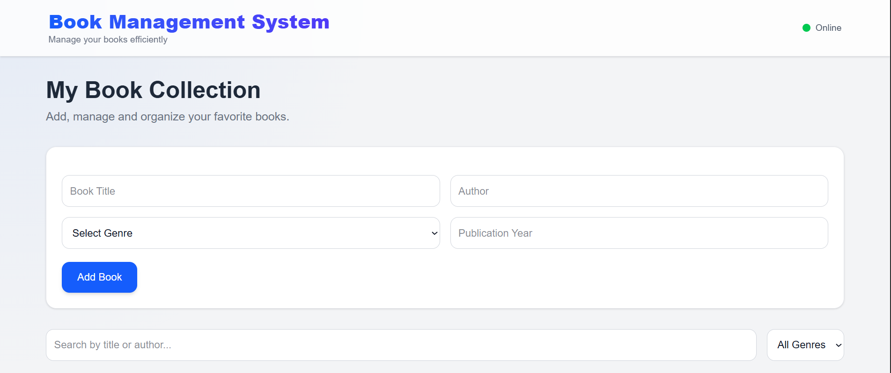
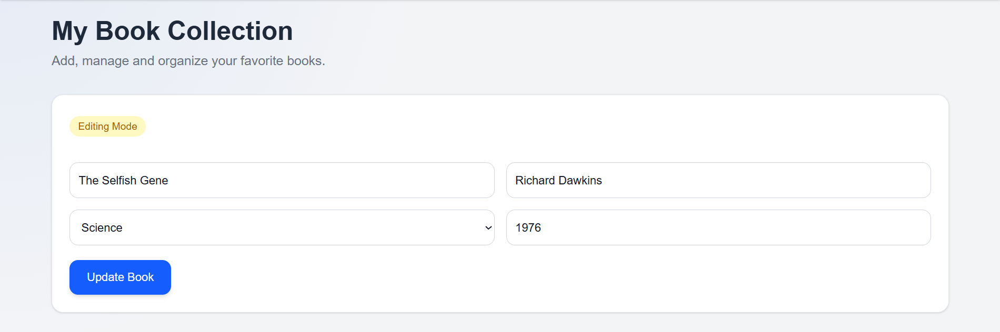
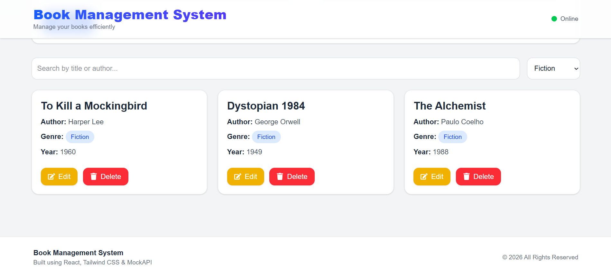

# 📚 Book Management System

A modern and responsive Book Management System built using React.js, Tailwind CSS, Axios, and MockAPI.  
This application allows users to manage books with full CRUD functionality, search, filtering, and a clean modern UI.

---

# ✨ Features

- 📖 View all books
- ➕ Add new books
- ✏️ Edit existing books
- 🗑️ Delete books
- 🔍 Search books by title or author
- 🎯 Filter books by genre
- 🔔 Toast notifications
- ⏳ Loading states
- 📱 Fully responsive design
- 🎨 Modern UI with Tailwind CSS
- 🌐 API integration using MockAPI
- 🔐 Environment variable support

---

# 🚀 Extra Features Added

- ✨ Modern aesthetic UI
- 🔔 Toast notifications using React Hot Toast
- 🎨 Tailwind CSS modern styling
- 📌 Sticky glassmorphism navbar
- 🎯 Smooth hover animations
- 🔄 Smooth scroll to edit form
- 🧠 Reusable genre constants
- 📦 Scalable API architecture
- 🌐 Environment variable support using `.env`
- 🧩 Reusable component structure
- 📱 Mobile responsive layout
- ⚡ Smooth transitions and animations
- 🪄 Modern empty states and loaders

---

# 🛠️ Tech Stack

## Frontend
- React.js
- Vite
- Tailwind CSS

## Libraries
- Axios
- React Hot Toast
- React Icons

## Backend/API
- MockAPI

## Deployment
- Vercel

---

# 📁 Project Structure

```bash
src/
│
├── components/
│   ├── Navbar.jsx
│   ├── Footer.jsx
│   ├── BookCard.jsx
│   ├── BookForm.jsx
│   ├── SearchFilter.jsx
│   └── Loader.jsx
│
├── constants/
│   └── genres.js
│
├── pages/
│   └── Home.jsx
│
├── services/
│   └── api.js
│
├── App.jsx
├── main.jsx
└── index.css
```

---

# ⚙️ Environment Variables Setup

Create a `.env` file in the root directory of the project.

Add the following variable:

```env
VITE_API_BASE_URL=YOUR_MOCKAPI_BASE_URL
```

Example:

```env
VITE_API_BASE_URL=https://example.mockapi.io/api/v1
```

---

# 📥 Step-by-Step Installation Guide

## 1️⃣ Clone the Repository

```bash
git clone https://github.com/Tapkir-Sahil/Book-Management-System.git
```

---

## 2️⃣ Navigate into the Project Folder

```bash
cd book-management-system
```

---

## 3️⃣ Install Dependencies

```bash
npm install
```

---

## 4️⃣ Setup Environment Variables

Create a `.env` file in the root directory.

Add:

```env
VITE_API_BASE_URL= https://6a15374b91ff9a63de07a3ad.mockapi.io/api/v1
```

---

## 5️⃣ Run the Development Server

```bash
npm run dev
```

The application will start on:

```txt
http://localhost:5173
```

---

# 🏗️ Build for Production

```bash
npm run build
```

---

# 🌐 Live Demo

🔗 Live URL:  
https://book-management-system-seven-sage.vercel.app/

---

# 📌 GitHub Repository

🔗 Repository Link:  
https://github.com/Tapkir-Sahil/Book-Management-System

---

# 📸 Screenshots

## Home Page



## Edit Form



## Books Cards




## Mobile Responsive View


---

# 🎯 Key Highlights

- Clean and scalable architecture
- Modern responsive UI
- Reusable components
- Centralized constants
- API-driven CRUD operations
- Professional frontend practices
- Smooth user experience
- Environment-based configuration

---

# 👨‍💻 Author

**Sahil Tapkir**